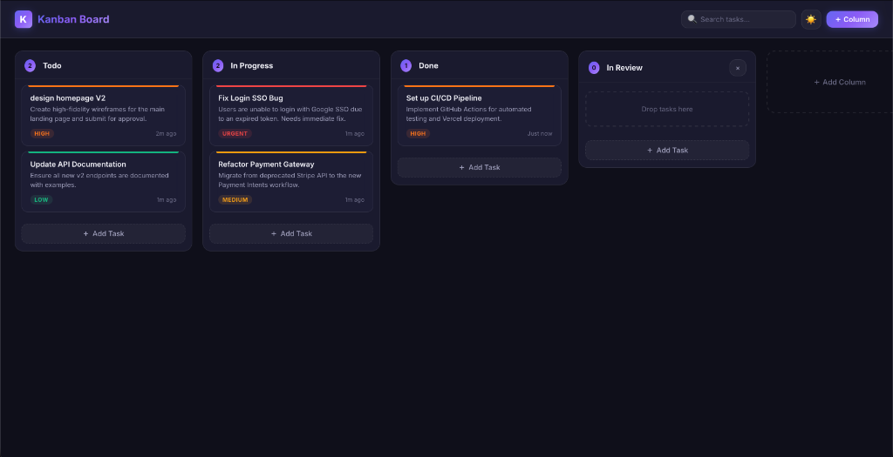
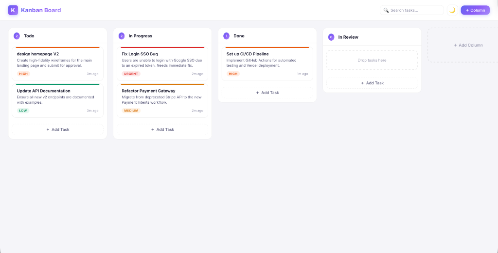
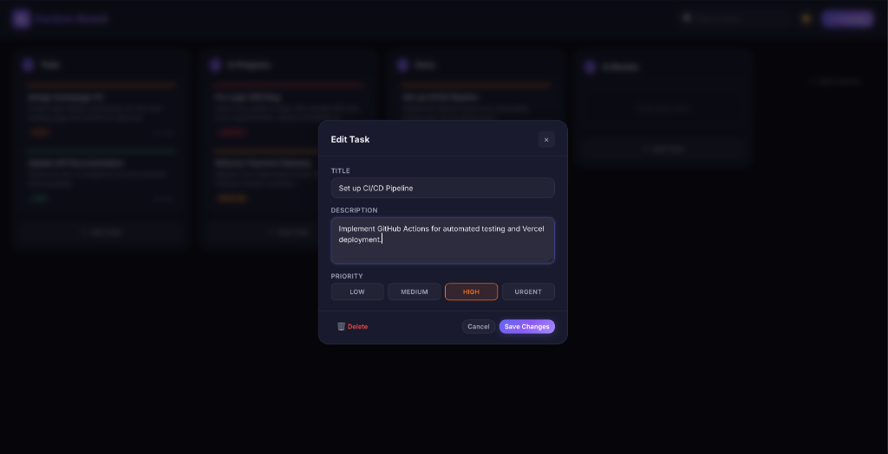

# Kanban Task Management Application

    

**[View Live Deployment](https://kanban-board-five-eosin.vercel.app)**

A responsive, single-page Kanban board application designed for task management. This project was built to demonstrate proficiency in modern web development, emphasizing clean architecture, native browser APIs, and zero-dependency implementation where possible.

---

## Application Interface

<p align="center">
  
</p>
<p align="center">
  &nbsp;
  
</p>

---

## Features

- **Dynamic Workflows:** Includes default columns (Todo, In Progress, Done) with the ability to freely create, rename, and delete custom workflow stages.
- **Task Management:** Create, edit, and delete tasks. Support for detailed descriptions and color-coded priority levels (Low, Medium, High, Urgent).
- **Search & Filtering:** Real-time search processing across all columns by task title, description, or priority.
- **Theme Support:** User-persisted dark and light mode toggling.
- **Responsive Layout:** Layout adapts seamlessly from horizontal desktop views to vertical mobile stacks.

---

## Technical Details

### Architecture & Implementation
This application minimizes external dependencies to showcase foundational engineering skills:

- **Native HTML5 Drag & Drop:** Orchestrated using the native `dataTransfer` API rather than relying on heavy third-party drag-and-drop libraries. Drop indices are calculated precisely based on cursor position relative to component bounding rectangles during the drag operation.
- **Vanilla CSS:** The entire design system is built using CSS Custom Properties (variables) and standard CSS modules (Flexbox, media queries), maintaining complete stylistic structure without utility class frameworks.
- **Client-Side Persistence:** Seamless state management leveraging standard `localStorage` to ensure task data, configurations, and user preferences persist across browser sessions.
- **Decoupled Logic:** Complex business logic (CRUD operations, state array manipulation, storage synchronization) is strictly separated from the presentation layer via custom React hooks (`useKanban`, `useTheme`).

---

## System Architecture

```text
src/
├── App.jsx                    # Root component & state provider
├── main.jsx                   # React entry point
├── index.css                  # Global styles and design system
├── hooks/
│   ├── useKanban.js           # Core state logic & storage sync
│   └── useTheme.js            # Theme toggle management
└── components/
    ├── Board.jsx              # Orchestrates columns and modals
    ├── Column.jsx             # Manages drop zones and task lists
    ├── TaskCard.jsx           # Draggable task entity
    ├── TaskModal.jsx          # Create/edit form interface
    ├── SearchBar.jsx          # Real-time filtering input
    └── ThemeToggle.jsx        # Aesthetic switch component
```

---

## Quick Start

### Prerequisites
- Node.js (v18 or higher)

### Local Development

1. **Clone the repository and navigate to the project directory:**
   ```bash
   cd projects/gdg
   ```

2. **Install dependencies:**
   ```bash
   npm install
   ```

3. **Start the development server:**
   ```bash
   npm run dev
   ```
   The application will be accessible at `http://localhost:5173/`.

### Building for Production
```bash
npm run build
```
This generates an optimized production bundle in the `dist/` directory.
